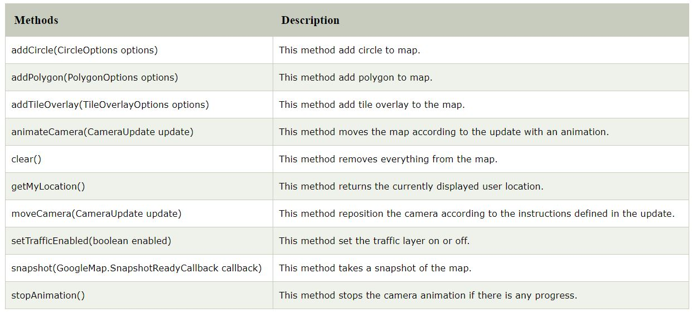
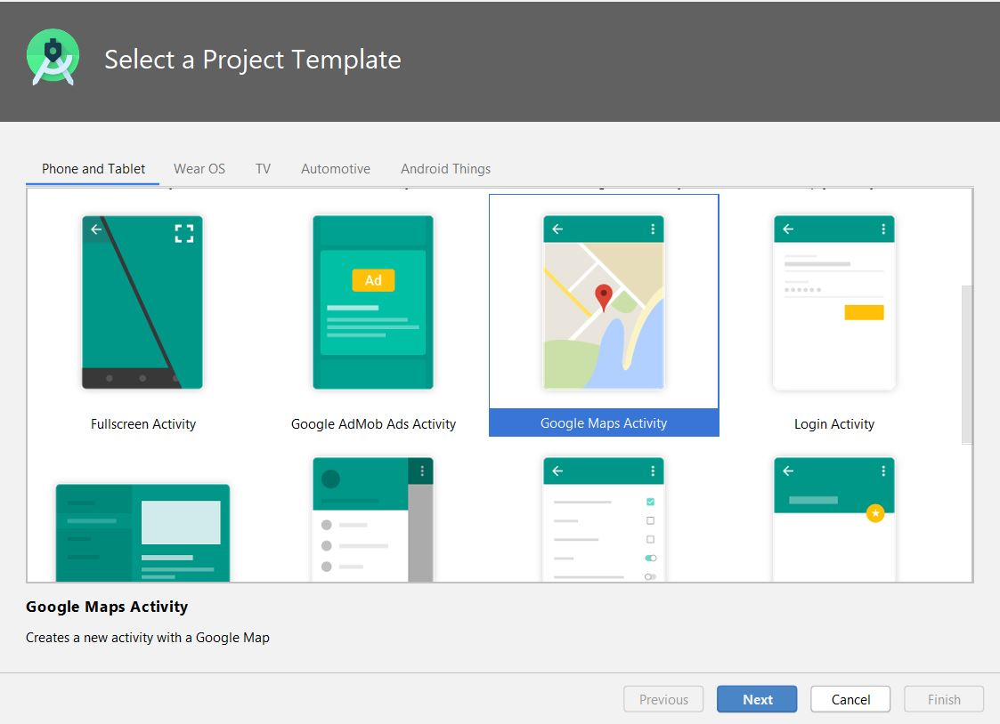

# AndroidDocumentation

Android provides facility to integrate Google map in our application. Google map displays your current location, navigate location direction, search location etc. We can also customize Google map according to our requirement.

## Types of Google Maps

 There are four different types of Google maps, as well as an optional to no map at all. Each of them gives different view on map. These maps are as follow:

1.**Normal:**  This type of map displays typical road map, natural features like river and some features build by humans.

2.**Hybrid:**  This type of map displays satellite photograph data with typical road maps. It also displays road and feature labels.

3.**Satellite:**  Satellite type displays satellite photograph data, but doesn't display road and feature labels.

4.**Terrain:**  This type displays photographic data. This includes colors, contour lines and labels and perspective shading.

5.**None:**  This type displays an empty grid with no tiles loaded.

## Syntax of different types of map

**googleMap.setMapType(GoogleMap.MAP_TYPE_NORMAL);**

**googleMap.setMapType(GoogleMap.MAP_TYPE_HYBRID);**

**googleMap.setMapType(GoogleMap.MAP_TYPE_SATELLITE);** 

**googleMap.setMapType(GoogleMap.MAP_TYPE_TERRAIN);** 

## Methods of Google map  

**Google map API provides several methods that help to customize Google map.These methods are as following:**

## Example of Google Map

Let's create an example of Google map integrating within our app. For doing this we select Google Maps Activity.

