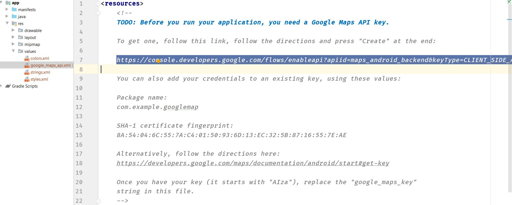
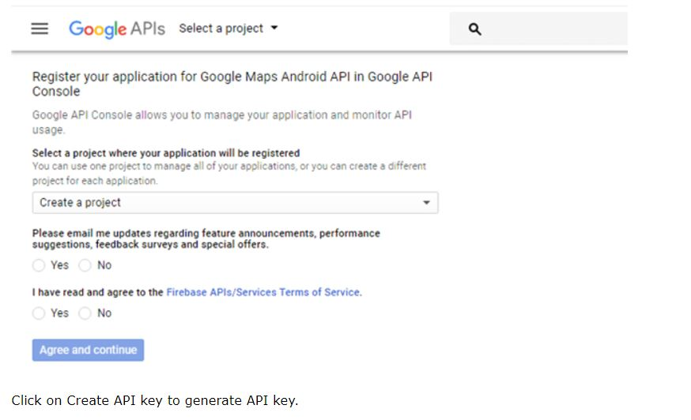
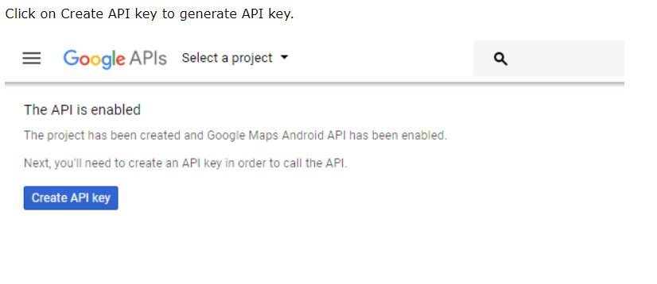
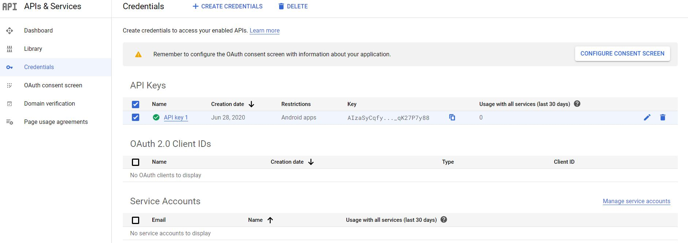
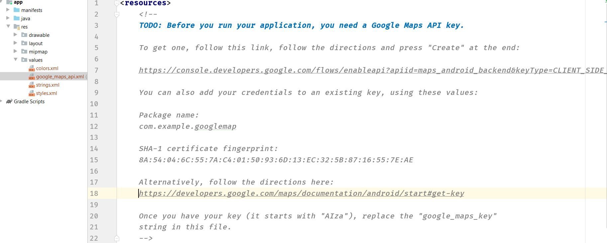
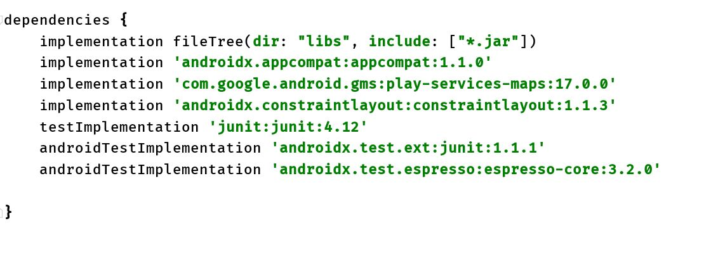

# AndroidDocumentation

Android provides facility to integrate Google map in our application. Google map displays your current location, navigate location direction, search location etc. We can also customize Google map according to our requirement.

## Types of Google Maps

 There are four different types of Google maps, as well as an optional to no map at all. Each of them gives different view on map. These maps are as follow:

1.**Normal:**  This type of map displays typical road map, natural features like river and some features build by humans.

2.**Hybrid:**  This type of map displays satellite photograph data with typical road maps. It also displays road and feature labels.

3.**Satellite:**  Satellite type displays satellite photograph data, but doesn't display road and feature labels.

4.**Terrain:**  This type displays photographic data. This includes colors, contour lines and labels and perspective shading.

5.**None:**  This type displays an empty grid with no tiles loaded.

## Syntax of different types of map

**googleMap.setMapType(GoogleMap.MAP_TYPE_NORMAL);**

**googleMap.setMapType(GoogleMap.MAP_TYPE_HYBRID);**

**googleMap.setMapType(GoogleMap.MAP_TYPE_SATELLITE);** 

**googleMap.setMapType(GoogleMap.MAP_TYPE_TERRAIN);** 

## Methods of Google map  

**Google map API provides several methods that help to customize Google map.These methods are as following:**

## Example of Google Map

Let's create an example of Google map integrating within our app. For doing this we select Google Maps Activity.

#### Copy the URL from google_map_api.xml file to generate Google map key.

###### Paste the copied URL at the browser. It will open the following page.

#### After clicking on Create API key, it will generate our API key displaying the following screen.

#### Copy this generated API key in our google_map_api.xml file

## activity_maps.xml

**<fragment xmlns:android="http://schemas.android.com/apk/res/android"  
    xmlns:map="http://schemas.android.com/apk/res-auto"  
    xmlns:tools="http://schemas.android.com/tools"  
    android:id="@+id/map"  
    android:name="com.google.android.gms.maps.SupportMapFragment"  
    android:layout_width="match_parent"  
    android:layout_height="match_parent"  
    tools:context="example.com.mapexample.MapsActivity" />**

### MapsActivity.java

To get the GoogleMap object in our MapsActivity.java class we need to implement the OnMapReadyCallback interface and override the onMapReady() callback method.

### Required Permission

Add the following user-permission in AndroidManifest.xml file.

**The ACCESS_COARSE/FINE_LOCATION permissions are not required to use  
         Google Maps Android API v2, but you must specify either coarse or fine  
         location permissions for the 'MyLocation' functionality.**

**<uses-permission android:name="android.permission.ACCESS_FINE_LOCATION" />  
<uses-permission android:name="android.permission.ACCESS_COARSE_LOCATION" />  
<uses-permission android:name="android.permission.INTERNET" />**  

#### build.gradel:

Add the following dependencies in build.gradel file.

